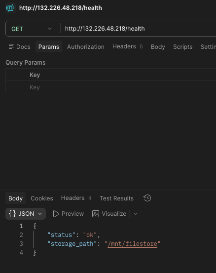
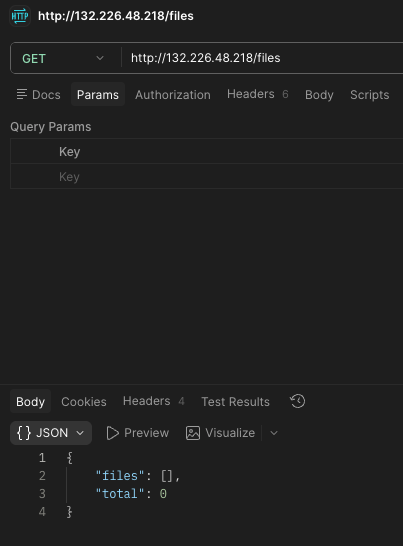
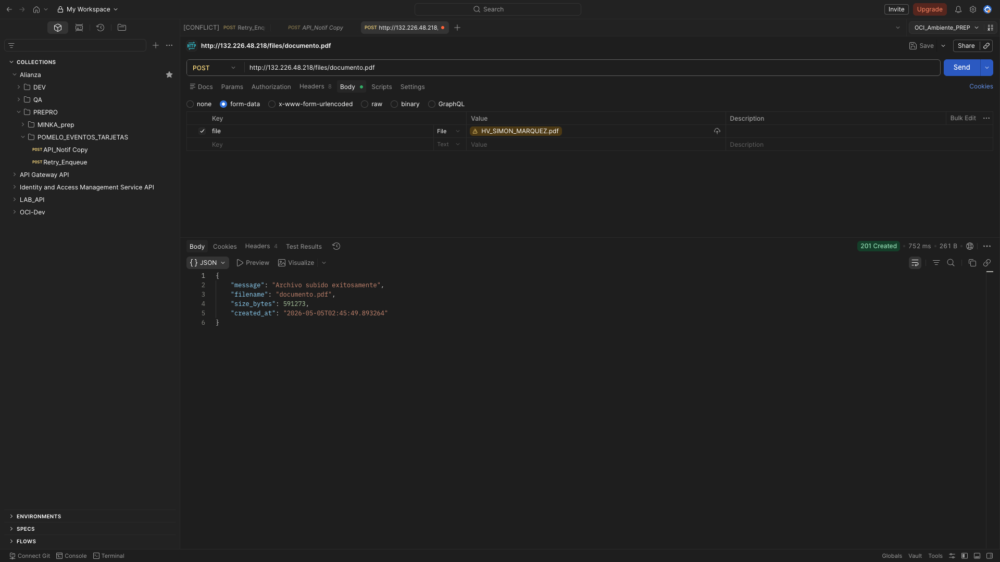
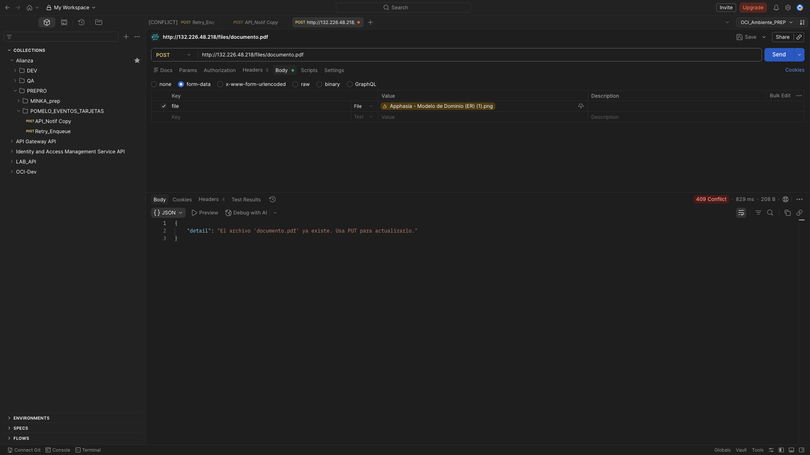
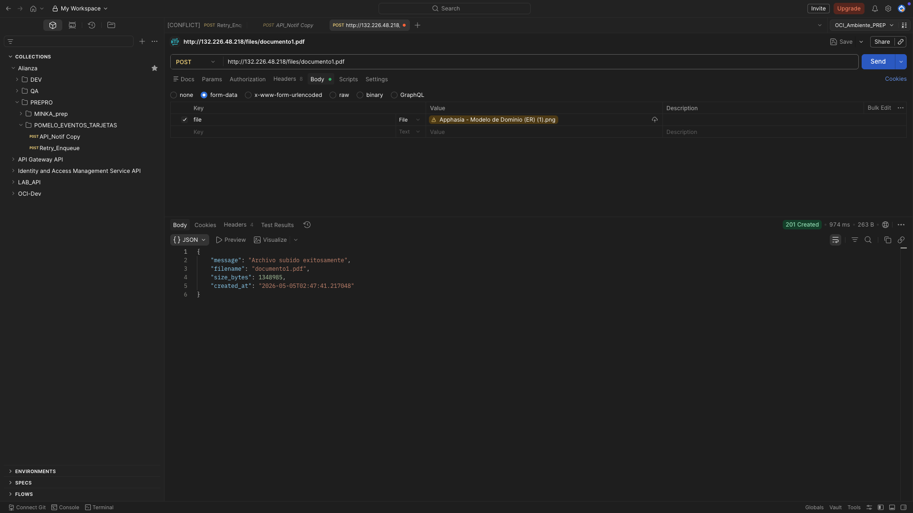
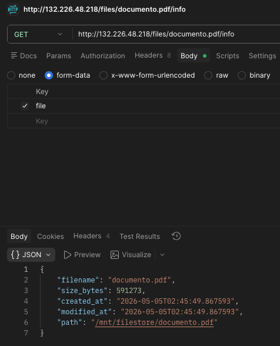
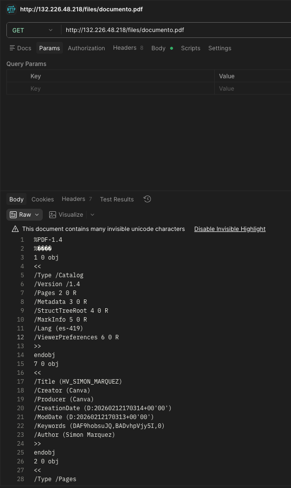
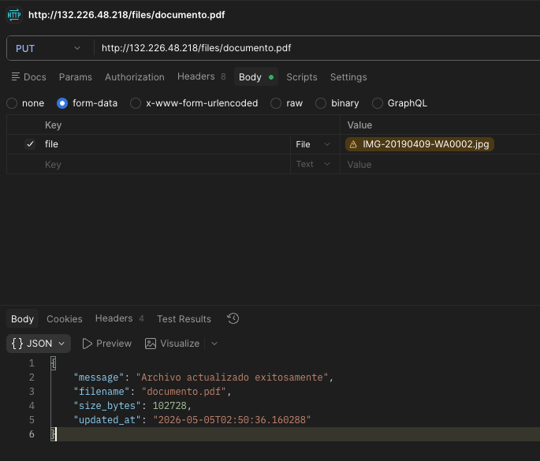
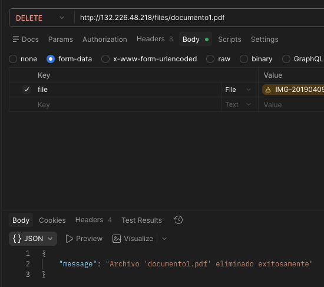

# 🗂️ OCI FileStorage CRUD API — POC Completa

> Microservicio REST sobre **OCI File Storage (NFS)**, desplegado en **Oracle Kubernetes Engine (OKE)**, administrado desde un **Bastion Host**.

---

[](https://www.python.org/)
[](https://fastapi.tiangolo.com/)
[](https://docs.oracle.com/en-us/iaas/Content/ContEng/home.htm)
[](https://cloud.oracle.com/)
[](https://www.docker.com/)

---

## 📐 Arquitectura

```
                        ┌──────────────────────────────────────────────────────┐
                        │                  OCI Cloud                           │
                        │                                                      │
    Tu máquina          │    ┌──────────────┐      ┌──────────────────────┐    │
    local/internet ─────┼───►│ Load Balancer│─────►│   OKE Cluster        │    │
                        │    │ (subnet-lb)  │      │  ┌────────────────┐  │    │
                        │    └──────────────┘      │  │ Pod: FastAPI   │  │    │
                        │                          │  │ (2 réplicas)   │  │    │
    Tú (admin) ─────────┼──► Bastion Host ─────►   │  └───────┬────────┘  │    │
                        │    (SSH + kubectl)       │          │           │    │
                        │    (subnet-bastion)      └──────────┼───────────┘    │
                        │                                     │                │
                        │                         ┌───────────▼───────────┐    │
                        │                         │  OCI File Storage     │    │
                        │                         │  (NFS Mount Target)   │    │
                        │                         │  /filestore           │    │
                        │                         └───────────────────────┘    │
                        └──────────────────────────────────────────────────────┘
```

---

## 📋 Tabla de Contenidos

- [Prerrequisitos y Variables](#-fase-0--prerrequisitos-y-planificación)
- [Fase 1 — Red (VCN y Subnets)](#-fase-1--crear-la-red)
- [Fase 2 — OCI File Storage](#-fase-2--crear-el-oci-file-storage)
- [Fase 3 — Cluster OKE](#-fase-3--crear-el-cluster-oke)
- [Fase 4 — Bastion Host](#-fase-4--crear-el-bastion-host)
- [Fase 5 — Código Python](#-fase-5--el-microservicio-en-python)
- [Fase 6 — OCIR (Imagen Docker)](#-fase-6--publicar-la-imagen-en-ocir)
- [Fase 7 — Manifiestos K8s](#-fase-7--manifiestos-de-kubernetes)
- [Fase 8 — Despliegue](#-fase-8--desplegar-todo-en-oke)
- [Fase 9 — Pruebas](#-fase-9--verificar-y-probar-la-api)
- [Fase 10 — Troubleshooting](#-fase-10--troubleshooting)
- [Resumen de Componentes](#-resumen-de-componentes)
- [Resultados POC](#-resultados-poc)

---

## 🗺️ Fase 0 — Prerrequisitos y planificación

Antes de tocar la consola, ten listos estos valores. Los irás completando a medida que avanzas:

```bash
TENANCY_OCID      = ocid1.tenancy.oc1..xxxxx
COMPARTMENT_OCID  = ocid1.compartment.oc1..xxxxx
REGION            = sa-bogota-1        # o tu región
VCN_OCID          = (Fase 1)
SUBNET_OKE_OCID   = (Fase 1)
SUBNET_LB_OCID    = (Fase 1)
SUBNET_BASTION    = (Fase 1)
MT_IP             = (Fase 2 — IP del Mount Target)
EXPORT_PATH       = /filestore
OKE_CLUSTER_OCID  = (Fase 3)
IP_BASTION        = (Fase 4)
OCIR_NAMESPACE    = (Fase 6)
```

---

## 🌐 Fase 1 — Crear la Red

### 1.1 — Crear la VCN

1. Ve a **Networking → Virtual Cloud Networks → Create VCN**
2. Configura:
   - **Name:** `vcn-poc-oke`
   - **IPv4 CIDR:** `10.0.0.0/16`
   - ✅ Selecciona **"VCN with Internet Connectivity"** (crea IGW y Route Table automáticamente)
3. Clic en **Create VCN**

---

### 1.2 — Crear las Subnets

Necesitas **3 subnets** con los siguientes rangos:

| Nombre | CIDR | Tipo | Uso |
|--------|------|------|-----|
| `subnet-oke-nodes` | `10.0.1.0/24` | **Privada** | Nodos del cluster K8s |
| `subnet-lb` | `10.0.2.0/24` | **Pública** | Load Balancer externo |
| `subnet-bastion` | `10.0.3.0/24` | **Pública** | Acceso SSH al cluster |

Para cada subnet: **Networking → VCN → Create Subnet** con los valores de la tabla.

- `subnet-oke-nodes` → Route Table: la privada con NAT Gateway (ver paso 1.3)
- `subnet-lb` y `subnet-bastion` → Route Table: la que tiene Internet Gateway

---

### 1.3 — NAT Gateway (para nodos privados)

Los nodos privados necesitan salida a internet (para descargar imágenes, etc.):

1. En tu VCN → **NAT Gateways → Create NAT Gateway**
   - **Name:** `nat-gw-poc`
2. Crea una Route Table privada:
   - **Name:** `rt-private-nodes`
   - Regla: Destino `0.0.0.0/0` → Target: `nat-gw-poc`
3. Edita `subnet-oke-nodes` y asígnale esta route table

---

### 1.4 — Security Lists

#### `subnet-oke-nodes` — Ingress Rules

| Source CIDR | Protocolo | Puerto | Descripción |
|-------------|-----------|--------|-------------|
| `10.0.0.0/16` | TCP | All | Tráfico interno VCN |
| `10.0.2.0/24` | TCP | 30000–32767 | NodePort desde LB |
| `10.0.1.0/24` | TCP | 2048–2050 | NFS |
| `10.0.1.0/24` | UDP | 2048 | NFS |
| `10.0.1.0/24` | TCP | 111 | Portmapper |
| `10.0.1.0/24` | UDP | 111 | Portmapper |

#### `subnet-oke-nodes` — Egress Rules
| Source CIDR | Protocolo | Puerto | Descripción |
|-------------|-----------|--------|-------------|
| `10.0.1.0/24` | TCP | 2048–2050 | NFS |
| `10.0.1.0/24` | UDP | 2048 | NFS |
| `10.0.1.0/24` | TCP | 111 | Portmapper |
| `10.0.1.0/24` | UDP | 111 | Portmapper |

#### `subnet-lb` — Ingress Rules

| Source CIDR | Protocolo | Puerto | Descripción |
|-------------|-----------|--------|-------------|
| `0.0.0.0/0` | TCP | 80 | HTTP público |
| `0.0.0.0/0` | TCP | 443 | HTTPS público |

#### `subnet-bastion` — Ingress Rules

| Source CIDR | Protocolo | Puerto | Descripción |
|-------------|-----------|--------|-------------|
| `0.0.0.0/0` | TCP | 22 | SSH (restringe a tu IP en producción) |

> ⚠️ En producción, reemplaza `0.0.0.0/0` del SSH por tu IP específica.

---

## 🗄️ Fase 2 — Crear el OCI File Storage

### 2.1 — Crear el File System

1. **Storage → File Storage → File Systems → Create File System**
2. Configura:
   - **File System Name:** `fs-poc-files`
   - **Availability Domain:** elige uno (ej: `AD-1`)
   - **Compartment:** el tuyo

### 2.2 — Crear el Mount Target

En el mismo panel:
- **Name:** `mt-poc`
- **VCN:** `vcn-poc-oke`
- **Subnet:** `subnet-oke-nodes` ← misma red que los pods
- Clic en **Create**

> 📌 Anota la **IP del Mount Target** (visible en la sección del Mount Target, algo como `10.0.1.XX`). La usarás en el PersistentVolume de K8s.

### 2.3 — Crear el Export

1. Entra al File System → **Exports → Create Export**
   - **Export Path:** `/filestore`
   - **Mount Target:** `mt-poc`
2. Clic en **Create Export**

---

## ☸️ Fase 3 — Crear el Cluster OKE

### 3.1 — Crear el cluster (Custom Create)

1. **Developer Services → Kubernetes Clusters (OKE) → Create Cluster**
2. Elige **Custom Create** para usar las subnets ya creadas
3. Configura:

| Campo | Valor |
|-------|-------|
| Name | `oke-poc-cluster` |
| Kubernetes Version | La más reciente disponible (ej: `v1.30.x`) |
| VCN | `vcn-poc-oke` |
| LB Subnets | `subnet-lb` |
| API Endpoint Subnet | `subnet-oke-nodes` |
| Assign public IP al API | ❌ NO (accedemos por Bastion) |

### 3.2 — Configurar el Node Pool

| Campo | Valor |
|-------|-------|
| Name | `nodepool-poc` |
| Shape | `VM.Standard.E4.Flex` (2 OCPUs, 16 GB RAM) |
| Image | Oracle Linux 8 (compatible con la versión de K8s) |
| Nodes | `2` |
| Subnet | `subnet-oke-nodes` |
| SSH Key | Agrega tu llave pública |

Clic en **Create Cluster** y espera ~10 minutos hasta que el estado sea **Active**.

---

## 🖥️ Fase 4 — Crear el Bastion Host

### 4.1 — Crear la instancia

1. **Compute → Instances → Create Instance**

| Campo | Valor |
|-------|-------|
| Name | `bastion-poc` |
| Image | Oracle Linux 8 |
| Shape | `VM.Standard.E2.1.Micro` (Free Tier ✅) |
| VCN | `vcn-poc-oke` |
| Subnet | `subnet-bastion` |
| IPv4 pública | ✅ Asignar |
| SSH Key | Pega tu llave pública |

> 📌 Anota la **IP pública** del Bastion.

---

### 4.2 — Instalar herramientas en el Bastion

```bash
# Conectarse al Bastion
ssh -i ~/.ssh/tu_llave_privada opc@<IP_PUBLICA_BASTION>

# Actualizar sistema
sudo dnf update -y

# Instalar OCI CLI
bash -c "$(curl -L https://raw.githubusercontent.com/oracle/oci-cli/master/scripts/install/install.sh)"
source ~/.bashrc

# Instalar kubectl
curl -LO "https://dl.k8s.io/release/$(curl -L -s https://dl.k8s.io/release/stable.txt)/bin/linux/amd64/kubectl"
chmod +x kubectl
sudo mv kubectl /usr/local/bin/

# Verificar instalaciones
kubectl version --client
oci --version
```

---

### 4.3 — Configurar OCI CLI

```bash
oci setup config
```

El wizard pedirá:
- **User OCID** → Tu perfil en OCI Console → copiar OCID
- **Tenancy OCID** → Administration → Tenancy Details
- **Region** → ej: `sa-bogota-1`
- **API Key** → el CLI genera un par. Copia la **llave pública** que muestra

Luego sube la llave pública a OCI:
1. **User → API Keys → Add API Key**
2. Pega la llave pública generada por el CLI

---

### 4.4 — Obtener el kubeconfig

```bash
OKE_CLUSTER_OCID="ocid1.cluster.oc1..xxxxx"   # reemplaza con el tuyo

oci ce cluster create-kubeconfig \
  --cluster-id $OKE_CLUSTER_OCID \
  --file $HOME/.kube/config \
  --region sa-bogota-1 \
  --token-version 2.0.0 \
  --kube-endpoint PRIVATE_ENDPOINT

# Verificar conexión — deberías ver 2 nodos en estado Ready
kubectl get nodes
```

---

## 🐍 Fase 5 — El Microservicio en Python

### Estructura del proyecto

```
filestore-api/
├── app/
│   └── main.py          ← API FastAPI con CRUD completo
├── Dockerfile
├── requirements.txt
└── k8s/
    ├── namespace.yaml
    ├── pv.yaml
    ├── pvc.yaml
    ├── deployment.yaml
    └── service.yaml
```

---

### `requirements.txt`

Define las 4 dependencias del microservicio. FastAPI es el framework web que expone los endpoints REST. Uvicorn es el servidor ASGI que corre la aplicación (el equivalente a Gunicorn pero async). python-multipart es obligatorio para que FastAPI pueda recibir archivos via formularios (multipart/form-data). aiofiles permite leer y escribir archivos de forma asíncrona sin bloquear el event loop, lo que hace que las subidas y descargas sean eficientes.

---

### `app/main.py`

Es el corazón del microservicio. Define una API REST con 7 endpoints que operan sobre un directorio del sistema de archivos (que en producción es el NFS montado). La ruta base de almacenamiento se lee de la variable de entorno STORAGE_PATH, lo que permite configurarla sin tocar el código. Cada operación CRUD está mapeada a su método HTTP correcto: POST para crear, GET para leer, PUT para actualizar y DELETE para borrar. Todas las operaciones de I/O son asíncronas gracias a aiofiles. El endpoint /health existe exclusivamente para que Kubernetes pueda verificar que el pod está vivo y listo para recibir tráfico.

---

### `Dockerfile`

Construye la imagen del contenedor en base a python:3.12-slim para mantenerla liviana. Instala las dependencias de Python desde requirements.txt, copia el código de la aplicación, crea el directorio /mnt/filestore que luego será reemplazado por el volumen NFS, y arranca el servidor Uvicorn escuchando en el puerto 8000 en todas las interfaces. La variable de entorno STORAGE_PATH está definida aquí con su valor por defecto.

---

### Endpoints disponibles

| Método | Ruta | Descripción |
|--------|------|-------------|
| `GET` | `/health` | Health check del servicio |
| `GET` | `/files` | Listar todos los archivos |
| `POST` | `/files/{filename}` | Subir un archivo nuevo |
| `GET` | `/files/{filename}` | Descargar un archivo |
| `PUT` | `/files/{filename}` | Actualizar un archivo existente |
| `DELETE` | `/files/{filename}` | Eliminar un archivo |
| `GET` | `/files/{filename}/info` | Ver metadata de un archivo |
| `GET` | `/docs` | Swagger UI interactivo 📖 |

---

## 📦 Fase 6 — Publicar la Imagen en OCIR

### 6.1 — Crear repositorio en OCIR

1. **Developer Services → Container Registry → Create Repository**
   - **Name:** `poc/filestore-api`
   - **Access:** Private
2. Anota el **namespace** de OCIR (algo como `axyz1234abc`, visible en la pantalla)

### 6.2 — Generar Auth Token

1. **User Settings → Auth Tokens → Generate Token**
   - **Description:** `ocir-poc`
2. Copia y guarda el token (solo se muestra una vez)

### 6.3 — Build y Push de la imagen

```bash
# Variables — ajusta con tus valores reales
REGION="sa-bogota-1"
NAMESPACE="axyz1234abc"
REPO="poc/filestore-api"
TAG="v1.0"

# Login en OCIR
docker login ${REGION}.ocir.io \
  -u "${NAMESPACE}/<tu_username_oci>" \
  -p "<tu_auth_token>"

# Build de la imagen
docker build -t ${REGION}.ocir.io/${NAMESPACE}/${REPO}:${TAG} .

# Push al registry
docker push ${REGION}.ocir.io/${NAMESPACE}/${REPO}:${TAG}
```

---

## ☸️ Fase 7 — Manifiestos de Kubernetes

Crea estos archivos en `filestore-api/k8s/`.

### `namespace.yaml`

Crea el namespace poc-filestore en Kubernetes. Es un espacio de nombres aislado donde vivirán todos los recursos de esta POC (pods, servicios, volúmenes, secrets). Sirve para no mezclar estos recursos con otros que pueda haber en el cluster.

---

### `pv.yaml`

> ⚠️ Reemplaza `<MT_IP>` con la IP real del Mount Target (anotada en Fase 2)

Crea un PersistentVolume que representa el File Storage de OCI dentro de Kubernetes. Le dice al cluster que existe un servidor NFS en la IP del Mount Target con el path /filestore, con capacidad de 50Gi. El modo de acceso ReadWriteMany es clave: permite que múltiples pods simultáneamente lean y escriban en el mismo volumen, algo que solo es posible gracias a NFS. La política Retain significa que si el PVC es eliminado, los datos no se borran automáticamente.

---

### `pvc.yaml`

Crea un PersistentVolumeClaim, que es la "solicitud" de un volumen por parte de la aplicación. Se enlaza estáticamente al PV anterior mediante volumeName: pv-filestore. Los pods no montan el PV directamente, siempre lo hacen a través del PVC, lo que desacopla la aplicación de los detalles de infraestructura del almacenamiento.

---

### Secret OCIR (comando directo en el Bastion)

```bash
kubectl create secret docker-registry ocir-secret \
  --docker-server=sa-bogota-1.ocir.io \
  --docker-username="<NAMESPACE>/<tu_username>" \
  --docker-password="<tu_auth_token>" \
  --docker-email="<tu_email>" \
  -n poc-filestore
```

---

### `deployment.yaml`

> ⚠️ Reemplaza la imagen con la URL real de tu OCIR

Le dice a Kubernetes cómo correr el microservicio. Define 2 réplicas del pod para alta disponibilidad. Especifica la imagen a usar desde OCIR (el registry privado de OCI), monta el PVC en /mnt/filestore dentro del contenedor, y establece límites de CPU y memoria para que ningún pod consuma recursos excesivos. Los liveness y readiness probes apuntan a /health: el liveness reinicia el pod si la app deja de responder, y el readiness evita que el Load Balancer envíe tráfico a un pod que aún no está listo.

---

### `service.yaml`

> ⚠️ Reemplaza `<SUBNET_LB_OCID>` con el OCID real de `subnet-lb`

Expone el Deployment al mundo exterior creando un Load Balancer de OCI automáticamente gracias al tipo LoadBalancer. Las anotaciones le indican a OCI que cree un LB flexible con capacidad entre 10 y 100 Mbps, y que lo coloque en la subnet pública (subnet-lb). El servicio recibe tráfico en el puerto 80 y lo redirige al puerto 8000 de los pods. Una vez creado, OCI asigna una IP pública que es la URL de entrada a toda la aplicación.

---

## 🚀 Fase 8 — Desplegar todo en OKE

### Copiar manifiestos al Bastion

```bash
# Desde tu máquina local
scp -i ~/.ssh/tu_llave -r filestore-api/k8s/ opc@<IP_BASTION>:~/k8s/

# Conectarse al Bastion
ssh -i ~/.ssh/tu_llave opc@<IP_BASTION>
```

### Aplicar todos los manifiestos

```bash
# 1. Crear namespace
kubectl apply -f ~/k8s/namespace.yaml

# 2. Crear secret para OCIR
kubectl create secret docker-registry ocir-secret \
  --docker-server=sa-bogota-1.ocir.io \
  --docker-username="<NAMESPACE>/<username>" \
  --docker-password="<auth_token>" \
  --docker-email="<email>" \
  -n poc-filestore

# 3. Crear el volumen persistente y el claim
kubectl apply -f ~/k8s/pv.yaml
kubectl apply -f ~/k8s/pvc.yaml

# 4. Verificar que el PVC quede en estado Bound
kubectl get pvc -n poc-filestore
# STATUS debe ser "Bound" antes de continuar

# 5. Desplegar la aplicación
kubectl apply -f ~/k8s/deployment.yaml

# 6. Exponer con Load Balancer
kubectl apply -f ~/k8s/service.yaml

# 7. Monitorear el despliegue
kubectl rollout status deployment/filestore-api -n poc-filestore
kubectl get pods -n poc-filestore
kubectl get svc -n poc-filestore
# Espera ~2-3 minutos hasta que aparezca la EXTERNAL-IP del LB
```

---

## ✅ Fase 9 — Verificar y Probar la API

Una vez que `kubectl get svc` muestre la `EXTERNAL-IP`:

```bash
LB_IP="<EXTERNAL_IP>"

# ── Health Check ──────────────────────────────────
curl http://$LB_IP/health

# ── Listar archivos (vacío al inicio) ────────────
curl http://$LB_IP/files

# ── Subir un archivo ─────────────────────────────
curl -X POST http://$LB_IP/files/documento.pdf \
  -F "file=@/ruta/local/documento.pdf"

# ── Listar archivos (aparece el subido) ──────────
curl http://$LB_IP/files

# ── Ver metadata del archivo ─────────────────────
curl http://$LB_IP/files/documento.pdf/info

# ── Descargar el archivo ─────────────────────────
curl -O http://$LB_IP/files/documento.pdf

# ── Actualizar archivo ───────────────────────────
curl -X PUT http://$LB_IP/files/documento.pdf \
  -F "file=@/ruta/local/documento_v2.pdf"

# ── Eliminar archivo ─────────────────────────────
curl -X DELETE http://$LB_IP/files/documento.pdf
```

> 📖 También puedes explorar la API visualmente en:
> ```
> http://<EXTERNAL_IP>/docs   ←  Swagger UI (generado automáticamente por FastAPI)
> ```

---

## 🔍 Fase 10 — Troubleshooting

### Ver logs de los pods

```bash
kubectl logs -f deployment/filestore-api -n poc-filestore
```

### Inspeccionar el montaje NFS dentro del pod

```bash
# Obtener nombre del pod
kubectl get pods -n poc-filestore

# Entrar al contenedor
kubectl exec -it <nombre-del-pod> -n poc-filestore -- /bin/bash

# Dentro del pod: verificar el mount
ls /mnt/filestore
df -h /mnt/filestore
```

### Ver eventos de un recurso (útil si el PVC no hace Bound)

```bash
kubectl describe pvc pvc-filestore -n poc-filestore
kubectl describe pod <nombre-pod> -n poc-filestore
kubectl describe svc filestore-api-svc -n poc-filestore
```

### Verificar NFS desde un nodo worker (SSH via Bastion como jump host)

```bash
# Conectar al nodo usando el Bastion como salto
ssh -J opc@<IP_BASTION> opc@<IP_NODO_PRIVADO>

# Dentro del nodo: verificar que el Mount Target responde
showmount -e <MT_IP>
# Debe mostrar: /filestore  *
```

### Reiniciar el deployment si es necesario

```bash
kubectl rollout restart deployment/filestore-api -n poc-filestore
kubectl rollout status deployment/filestore-api -n poc-filestore
```

### Problemas comunes

| Síntoma | Causa probable | Solución |
|---------|---------------|----------|
| PVC en `Pending` | IP del MT incorrecta o puerto NFS bloqueado | Verificar Security List y la IP del Mount Target |
| Pod en `ImagePullBackOff` | Secret OCIR incorrecto o imagen no existe | Verificar el secret y que la imagen fue pusheada |
| LB sin `EXTERNAL-IP` | OCID de subnet-lb incorrecto en el annotation | Revisar el `service.yaml` y re-aplicar |
| Error 500 al subir | `/mnt/filestore` sin permisos de escritura | Verificar el Export del File Storage |
| SSH al Bastion falla | Puerto 22 bloqueado en Security List | Agregar regla de ingress en `subnet-bastion` |

---

## 📊 Resumen de Componentes

| Componente | Tipo | Propósito |
|---|---|---|
| `vcn-poc-oke` | VCN | Red principal `10.0.0.0/16` |
| `subnet-oke-nodes` | Subnet Privada `10.0.1.0/24` | Nodos K8s y File Storage |
| `subnet-lb` | Subnet Pública `10.0.2.0/24` | Load Balancer externo |
| `subnet-bastion` | Subnet Pública `10.0.3.0/24` | Acceso SSH al cluster |
| `nat-gw-poc` | NAT Gateway | Salida a internet para nodos privados |
| `fs-poc-files` | OCI File Storage | Almacenamiento NFS persistente |
| `mt-poc` | Mount Target | Punto de montaje NFS |
| `bastion-poc` | Compute VM (Free Tier) | Acceso kubectl al cluster |
| `oke-poc-cluster` | OKE Cluster | Orquestación de contenedores |
| `nodepool-poc` | Node Pool (2 nodos) | Capacidad de cómputo |
| `poc/filestore-api` | OCIR Repository | Registry privado de imagen Docker |
| `pv-filestore` | PersistentVolume K8s | Mapeo NFS en Kubernetes |
| `pvc-filestore` | PersistentVolumeClaim K8s | Claim del volumen para los pods |
| `filestore-api` | Deployment K8s (2 réplicas) | Microservicio FastAPI |
| `filestore-api-svc` | LoadBalancer Service K8s | Exposición pública HTTP |

---

---

## 🧪 Resultados POC

A continuación se muestran capturas de las pruebas realizadas contra la API desplegada en OKE (a través de la IP pública del Load Balancer `132.226.48.218`), ejecutadas desde Postman recorriendo todo el ciclo CRUD del microservicio.

### 1. Health Check — `GET /health`



Verificación de que el pod está vivo y el volumen NFS está correctamente montado. La API responde **200 OK** con `{"status": "ok", "storage_path": "/mnt/filestore"}`, confirmando que el `STORAGE_PATH` definido por la variable de entorno apunta al File Storage de OCI.

---

### 2. Listado inicial — `GET /files`



Primer listado de archivos sobre el File Storage recién montado. La respuesta **200 OK** devuelve `{"files": [], "total": 0}`, lo que confirma que el volumen está accesible desde el pod pero aún no contiene ningún archivo.

---

### 3. Subida de archivo — `POST /files/documento.pdf`



Carga de un archivo (`HV_SIMON_MARQUEZ.pdf`) usando `multipart/form-data` y guardado en el NFS bajo el nombre `documento.pdf`. La API responde **201 Created** con metadata del archivo: tamaño (`591273` bytes) y timestamp de creación.

---

### 4. Validación de duplicados — `POST` sobre archivo existente



Al intentar volver a subir un archivo con el mismo nombre, la API responde **409 Conflict** con el mensaje `"El archivo 'documento.pdf' ya existe. Usa PUT para actualizarlo."`. Esto demuestra que el endpoint distingue correctamente entre creación (POST) y actualización (PUT).

---

### 5. Subida de un segundo archivo — `POST /files/documento1.pdf`



Subida de un segundo archivo distinto (`Apphasia - Modelo de Dominio (ER) (1).png`) renombrado como `documento1.pdf`. Respuesta **201 Created** confirmando que múltiples archivos pueden coexistir en el mismo volumen NFS compartido entre las réplicas del Deployment.

---

### 6. Metadata de un archivo — `GET /files/documento.pdf/info`



Consulta de la información detallada del archivo: nombre, tamaño en bytes, fecha de creación, fecha de modificación y ruta absoluta dentro del NFS (`/mnt/filestore/documento.pdf`). Útil para inspeccionar el estado del archivo sin necesidad de descargarlo.

---

### 7. Descarga de archivo — `GET /files/documento.pdf`



Descarga del contenido binario del PDF directamente desde el File Storage. La respuesta **200 OK** devuelve el archivo crudo, demostrando que el flujo de lectura asíncrono con `aiofiles` funciona correctamente sobre el volumen NFS.

---

### 8. Actualización de archivo — `PUT /files/documento.pdf`



Reemplazo del contenido de `documento.pdf` con un nuevo archivo (`IMG-20190409-WA0002.jpg`). La API responde **200 OK** con `"Archivo actualizado exitosamente"` y el nuevo `size_bytes` y `updated_at`, confirmando que el PUT sobreescribe correctamente el contenido en el NFS.

---

### 9. Eliminación de archivo — `DELETE /files/documento1.pdf`



Borrado del archivo `documento1.pdf` desde el File Storage. La respuesta **200 OK** con `"Archivo 'documento1.pdf' eliminado exitosamente"` cierra el ciclo CRUD completo (Create, Read, Update, Delete) operando contra el almacenamiento NFS persistente expuesto en OCI.

---

> ✅ **Conclusión de la POC:** todos los endpoints CRUD operan correctamente sobre el OCI File Storage montado vía NFS dentro del cluster OKE, accesible públicamente a través del Load Balancer gestionado automáticamente por OCI.

---

<div align="center">

**Construido con** ☁️ Oracle Cloud Infrastructure · 🐍 Python / FastAPI · ☸️ Kubernetes

</div>